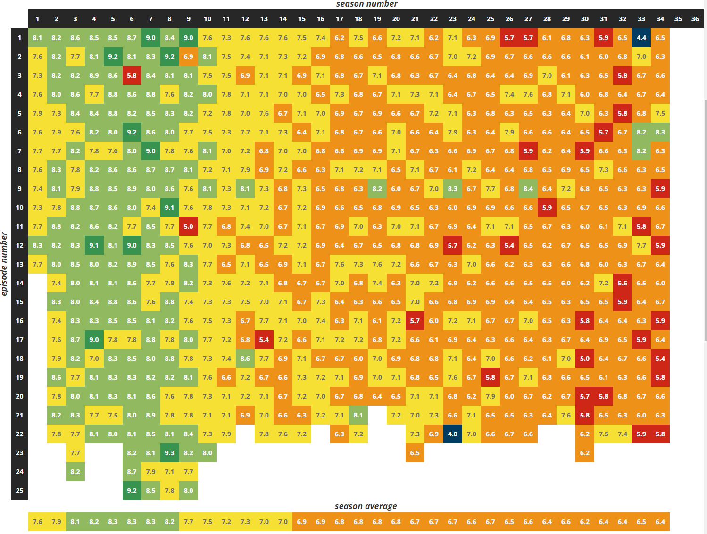
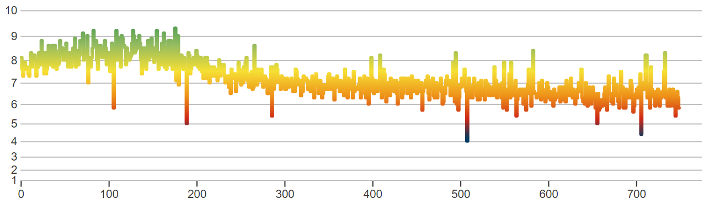

# TV Show Episode Ratings from IMDb

Welcome to the TV Show Episode Ratings project! This repository contains the source code for a web application that fetches episode ratings for TV shows from IMDb and presents the data with engaging and insightful visualizations.

The production environment can be found here: https://episodesrating.com/

## Overview

This project is designed to help users explore and analyze the episode ratings of their favorite TV shows. By retrieving data from IMDb, the application provides a detailed view of how episodes have been rated over time, along with visualizations to highlight trends, peaks, and valleys in a show's popularity.

## Example visualization

Below are example visualization created for the famous TV show 'The Simpsons'. Data is beautiful 💖

### Matrix View

### Pulse View

## Features

- **Search for TV Shows:** Input a TV show's name to retrieve its episodes and ratings from IMDb.
- **Data Visualization:** Visualize episode ratings using charts and graphs to identify trends and standout episodes.
- **Episode Details:** View detailed information about each episode, including air date, season, and rating.

## Project Structure

- EpisodesRatingsWeb - Frontend, website. ASP.NET MVC.
- EpisodesRatingModel - Project containing database models and migrations.
- EpisodesRatingFunctionApp - Serverless application whose purpose is two-fold: 1) to retrive data from IMDB; 2) to schedule the updates of TV series, which already exist in the database.
- EpisodesRatingApiClients - Project containing clietns for third-party services, like IMDB.
- EpisodesRatingConsoleApp - Console application meant for manual testing.